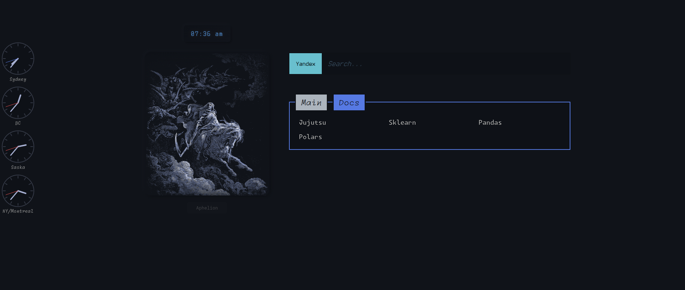

# StartPage

A local start page meant to be looked at, used, and altered without any complex overhead. It provides themed layout, tabbed bookmarks, a search prompt with selectable engines, and a dock of world clocks. Very plain and straightforward configuration: edit the JSON blocks embedded in `index.html`.

## What you get

- Theme switcher with optional sidebar image per theme.
- Tabbed bookmarks with per-tab density controls.
- Search prompt with a selectable engine, persisted across sessions.
- World clocks rendered locally from IANA timezone identifiers.

## Install

Load as an unpacked extension:

1. Open extensions page.
2. Enable developer mode.
3. Load unpacked and select this folder.

The included `manifest.json` overrides the new tab page.

## Customize

All routine customization sits in `index.html`:

### Bookmarks

Edit the JSON inside:

- ``

Each entry is a tab:

- `tab`: stable id
- `label`: display name
- `density`: `compact | cozy | roomy` or a raw CSS length such as `"25ch"`
- `links`: `{ name, url }[]`

### Themes

Edit:

- ``

Each theme supplies:

- `key`, `label`
- `href`: CSS file
- optional `image`: `{ src, height }`

### World clocks

Edit:

- ``

Use IANA TZ database names (examples: `Australia/Sydney`, `America/Montreal`).

### Search engines

Edit:

- ``

Keys become labels; values are query prefixes.
